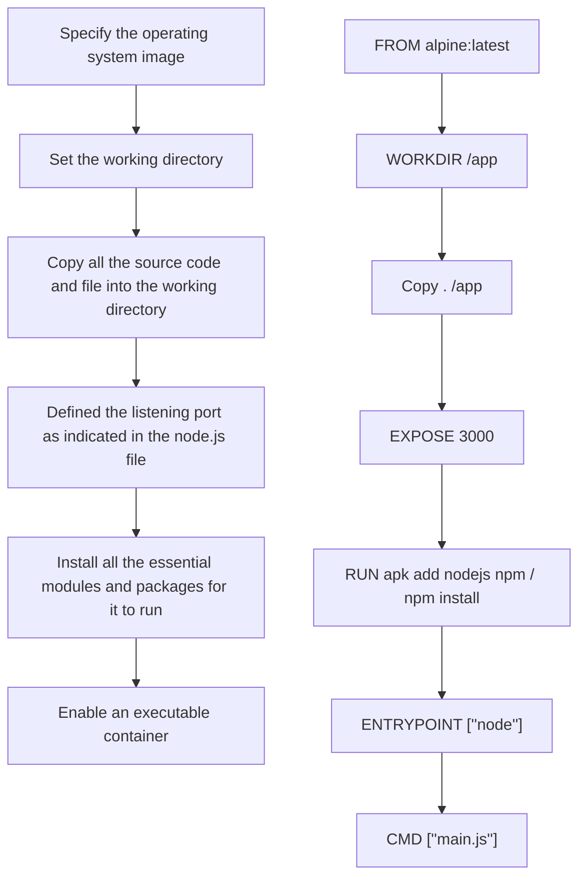

# NUSFintechDevops - CI/CD Flow

#### Deployed Pages
https://nusfintechdevopsfx-3w6afueuvq-as.a.run.app/main.html

## Front end Development
***
Build javascript(JS) to connect Polygon.io API to get Forex,Stock and Crypto price movement via the user input in the html.
___
- Build node.js(main.js) where it start a listen port 3000 and redirect the any access to the page to the main.html front.
- Link the FXcheck.js,Stock.js and Crypto.js to a frontend interface (main.html and split.css) where it serve to collect the user input to make the relevant API call and display the desired results.
- The main.html has a hyperlink to FX.html where the FX conversion is performed after the user input throught FX.js API call to get the ccnversion result.

## App containerization using Docker
***
##### Create a Dockerfile

- Specify the operating system image                            `FROM alpine:latest`
- set the working directory                                     `WORKDIR /app`
- Copy all the source code into the working directory           `Copy . /app`
- Defined the listening port as indicated in the node.js file   `EXPOSE 3000`
- Install all the essential modules and packages for it to run  `RUN apk add nodejs npm npm install`
- Enable an executable container                                `ENTRYPOINT ["node"]` & `CMD ["main.js"]`





With the created Dockerfile, the following steps were executed :
https://docs.docker.com/engine/reference/commandline/docker/

##### Build Docker Image 
```docker build -t mainjs . ```

##### Check on the existing image
```docker images ```

##### Run the images with a container
```docker run -it -d -p 3001:3000 mainjs ```

##### Check any container is running
```docker ps ```

##### Stop the container from running
 ```docker stop c42758de58f0 ```
 
## Continuous Integration & Continuous Development 
***
### Docker Hub & YAML
Using the Github action to continuous build and push any git push file update to DockerHub to ensure that the images is always up to date for container deployment.

Workflow (YAML file)
- Setup the docker login with the secret.username and password
- Setup the Node.js environment
- Build the Docker Image
- Enable Docker Push

 Docker Image for deployment 
 ---
 ```docker pull andrewlimyh/mainjs```

 
***


